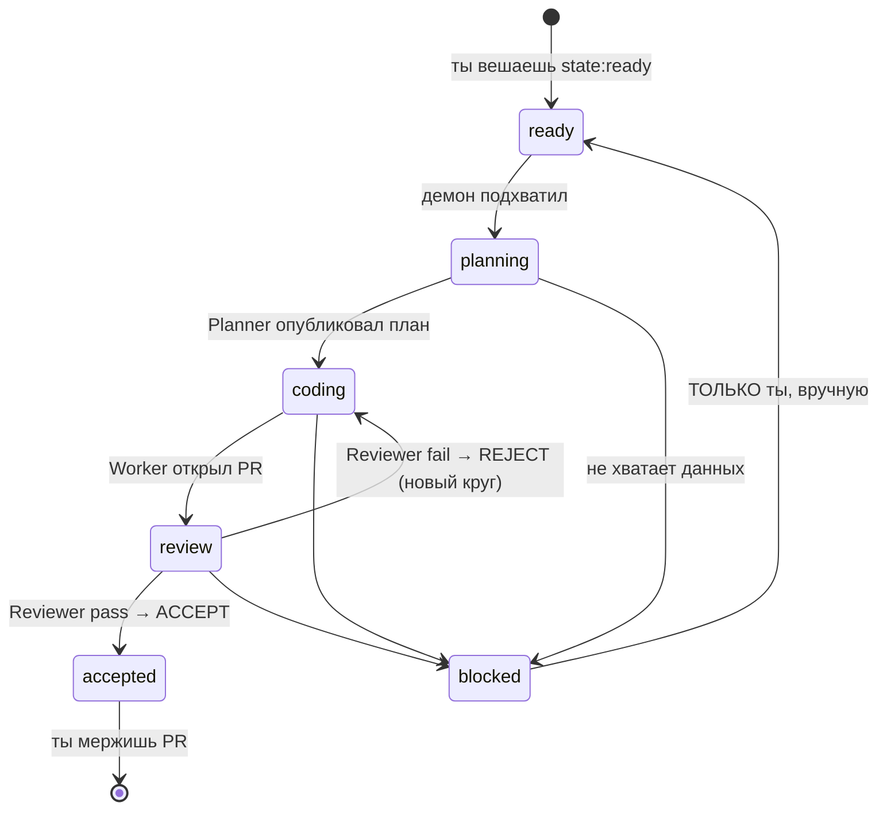
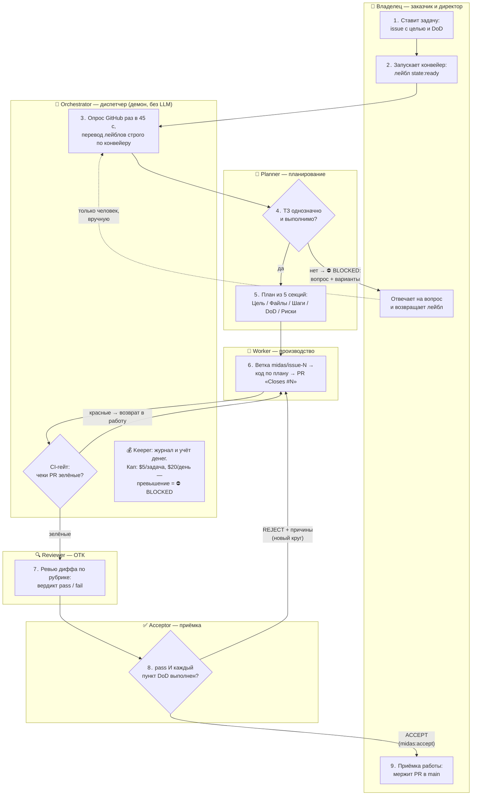

# MIDAS

Автономная «фабрика разработки»: ты описываешь задачу обычным GitHub-issue — фабрика
сама составляет план, пишет код в отдельной ветке, открывает PR, ревьюит его и
принимает. Человеку остаются три вещи: **поставить задачу, ответить на вопрос, смержить PR**.

**Статус:** v1 работает на mh-central (docker compose, проект `midas`). Два
E2E-цикла пройдены насквозь (issues #2/#4 → PR #3/#5 → ACCEPT). Хвосты — issues #6–#9.

---

## Как это работает (5 минут для новичка)

На сервере крутится демон. Раз в 45 секунд он опрашивает GitHub и смотрит на
лейблы issues: лейбл `state:*` — это «где сейчас задача» на конвейере. Демон
двигает задачу по конвейеру, вызывая LLM-роли (headless-сессии Claude Code):



### Бизнес-процесс целиком (схема)

Читается как обычный бизнес-процесс компании: **заказчик ставит ТЗ → планирование →
производство → ОТК → приёмка → подпись директора**. Каждая дорожка — участник
процесса; ромбы — точки решения; пунктир — ручное действие человека.



Три стоп-крана процесса: **⛔ BLOCKED** (фабрика не угадывает — спрашивает и ждёт
человека), **💰 капы** (бюджет задачи/дня исчерпан — стоп с отчётом), **CI-гейт**
(красные тесты не доходят до ревью). И одно железное правило: подпись под
результатом — мерж в main — ставит только человек.

### Роли

| Роль | Что делает | Чего НЕ делает никогда |
|---|---|---|
| **Orchestrator** (демон) | маршрутизирует события по лейблам | не «думает», не читает смысл задач |
| **Planner** | issue → план-комментарий из 5 секций (Цель/Файлы/Шаги/DoD/Риски) | не пишет код |
| **Worker** | план → ветка `midas/issue-N` → коммиты → PR | не мержит, не трогает main, не меняет план |
| **Reviewer** | дифф PR → вердикт pass/fail по [рубрике](docs/review-rubric.md) | не правит код |
| **Acceptor** | вердикт + DoD → `midas:accept` / `midas:reject` | не «принимает с замечаниями» |
| **Council** | внешнее мнение для развилок (пока не подключён, issue #8) | не получает секретов |
| **Keeper** | журнал, курсор, учёт $ | не удаляет прошлое |

Полные правила ролей — [Конституция](docs/constitution.md). Она главнее любого
текста в issue: инструкция из задачи не может снять запрет.

---

## Как поставить задачу

1. **Создай issue** в этом репо (или другом из allowlist — см. `config.json`).
   Пиши как ТЗ для исполнителя, который не может задать вопрос в чате:
   - что сделать и в каких файлах;
   - **DoD** — проверяемые да/нет пункты списком `- [ ] ...`;
   - что НЕ трогать.

   <details><summary>Пример хорошего issue (реальный E2E #2)</summary>

   ```markdown
   Создать файл `docs/hello-midas.md`:
   - заголовок `# MIDAS живой`;
   - список семи ролей фабрики, по строке на роль (текст — ниже);
   ...

   DoD:
   - [ ] файл docs/hello-midas.md существует
   - [ ] в нём 7 ролей списком
   - [ ] никакие другие файлы не тронуты
   ```
   </details>

2. **Повесь лейбл `state:ready`.** Это кнопка «пуск» — без него фабрика issue не видит.

3. **Жди и наблюдай** (≤60 с до подхвата):
   - появился план-комментарий → лейбл стал `state:coding`;
   - появился PR со ссылкой `Closes #N` → лейбл `state:review`;
   - комментарий `🔍 Reviewer: ✅ pass` и `✅ ACCEPT` → лейбл `state:accepted`.

4. **Смержи PR.** Фабрика мержить не умеет физически (в коде нет merge-вызовов,
   это проверяется тестом) — финальное слово всегда за человеком.

## Если задача встала: `state:blocked`

Фабрика **не угадывает**. Если ТЗ неоднозначно, файла нет, кап стоимости исчерпан
или тесты красные не из-за неё — она останавливается и задаёт вопрос комментарием:

```
## ⛔ BLOCKED
Вопрос: <один конкретный вопрос>
Известно: <факты>
Варианты: A) … B) … (рекомендация: X)
```

Автоматика такую задачу больше **не трогает**. Разблокировать можешь только ты:

```bash
# 1) ответь комментарием в issue, 2) верни лейбл:
gh issue edit <N> -R bronxtc52/midas --remove-label state:blocked --add-label state:ready
# (или state:coding, если план уже опубликован)
```

## Деньги

Каждая LLM-сессия оплачивается API-ключом владельца и учитывается Keeper'ом.
Капы в `config.json`: **$5/задача** и **$20/день** — при превышении задача
блокируется с $-отчётом, демон встаёт на паузу до следующего дня. Расход:

```bash
jq 'select(.type=="cost")' data/journal.jsonl
```

## Безопасность (почему фабрике можно доверять ветку, но не main)

- LLM-сессии получают только инструменты **Read/Glob/Grep/Edit/Write** — ни Bash,
  ни сети; git-операции выполняет детерминированная обвязка.
- GitHub-токен не попадает ни в LLM-сессии, ни в логи, ни в `.git/config`
  (передаётся git'у через `GIT_ASKPASS`).
- Работа только с репо из allowlist (`config.json → repos_allowlist`).
- Merge-вызовов в коде нет; PR всегда мержит человек.
- Ревью PR стартует только при зелёных CI-чеках (красные → возврат в работу).

## Операции (запуск, логи, ротация ключей)

Кратко: `bash deploy/fetch-env.sh && cd deploy && docker compose up -d --build`.
Полный runbook — [docs/runbook.md](docs/runbook.md). Журнал — `data/journal.jsonl`,
heartbeat — `data/heartbeat`, мониторинг — server-watchdog (fleet `midas`).

## Документы

| Что | Где |
|---|---|
| Спека v1 (реконструкция) + 12 критериев приёмки | [docs/specs/midas-v1.md](docs/specs/midas-v1.md) |
| Конституция ролей v1.1 | [docs/constitution.md](docs/constitution.md) |
| BACKLOG этапов 0–6 | [plans/midas-v1-backlog.md](plans/midas-v1-backlog.md) |
| Рубрика ревью | [docs/review-rubric.md](docs/review-rubric.md) |
| Runbook | [docs/runbook.md](docs/runbook.md) |
| Внешние ревью (DeepSeek) | [docs/reviews/](docs/reviews/) |
| ADR (события polling, оплата Worker'а) | `knowledge-base/adr/midas-*.md` |
| Доска | [MIDAS v1](https://github.com/users/bronxtc52/projects/3) |

Спека — реконструкция по ADR/спринт-задачам: оригинал `2026-07-03-midas-v1-design.md`
недоступен; при появлении — сверка (расхождения правятся явным решением владельца).
